<p align="center">
  
</p>
<h1 align="center">JanGinti: Counting the Pulse of the Crowd</h1>
<p align="center">
  <strong>CSRNet-powered crowd density estimation with an interactive web simulator</strong><br/>
  <em>Two-phase training on ShanghaiTech + custom Indian crowd dataset → deployed as a real-time web application</em>
</p>
<p align="center">
  <a href="https://janginti.felixau.in/" target="_blank"><strong>🚀 Live Web Application: janginti.felixau.in</strong></a>
</p>

<p align="center">
  <a href="https://janginti.felixau.in/"></a>
  
  
  
  
  
  
  
</p>

---

## 📋 Table of Contents

- [Overview](#-overview)
- [Why JanGinti?](#-why-janginti)
- [Visualizations](#-visualizations)
- [Features](#-features)
- [Architecture](#-architecture)
- [Training Pipeline](#-training-pipeline)
- [Quick Start](#-quick-start)
- [Project Structure](#-project-structure)
- [Dependencies](#-dependencies)
- [Results](#-results)
- [Improvement Ideas](#-improvement-ideas)
- [License](#-license)
- [Author](#-author)

---

## 🔍 Overview

**JanGinti** (Hindi: जन-गिंती — "People Counting") is an end-to-end crowd density estimation system built on the **CSRNet** architecture. The project covers the complete deep learning pipeline — from dataset preparation and two-phase model training to deployment in a production-ready web application.

The system:
- **🧠 Trains** a CSRNet model from scratch on ShanghaiTech Part A, then fine-tunes it on Parts A + B + a custom Indian crowd dataset (Part C)
- **🔬 Evaluates** on 498 test images with per-image MAE/MSE analysis
- **🌐 Deploys** the trained model via a FastAPI backend, powering an interactive canvas-based crowd flow simulator
- **🇮🇳 Bridges the gap** — introduces Indian crowd data to a field dominated by Western and East Asian benchmarks

> 🏆 **Outperforms the original CSRNet paper on BOTH partitions:**
> - **Part A** — MAE: **63.31** vs. paper's 68.2 (**7.2% better**)
> - **Part B** — MAE: **8.37** vs. paper's 10.6 (**21% better**)

---

## 🎯 Why JanGinti?

> **"जन-गिंती" — Every person in the crowd counts.**

### 🌍 The Western Crowd Bias Problem

Standard crowd counting benchmarks (ShanghaiTech, UCF-QNRF, JHU-Crowd++) predominantly contain **Western and East Asian crowd scenes**. Indian crowd scenarios present unique challenges:

- **Diverse cultural contexts** — festivals, religious gatherings, political rallies with distinctive crowd behaviors
- **Varied attire** — saris, turbans, religious garments that differ significantly from Western clothing
- **Extreme density** — Kumbh Mela gatherings can exceed 30 million people, creating density patterns unseen in existing benchmarks
- **Distinctive spatial formations** — temple queues, railway platform crowding, bazaar configurations

JanGinti addresses this gap by introducing a **custom Part C dataset** of 85 Indian crowd images and demonstrating that fine-tuning on diverse, culturally representative data **outperforms the original paper's results**.

| Aspect | Description |
|---|---|
| **Academic Rigor** | Two-phase training methodology with documented metrics, loss curves, and per-image evaluation |
| **🇮🇳 Indian Crowd Data** | 85 custom-scraped images (Kumbh Mela, railway stations, temples, festivals, markets, cricket stadiums) — addressing the Western bias in existing benchmarks |
| **Real Deployment** | Not just a notebook — a production FastAPI + Vite web app with interactive crowd simulation |
| **🏆 Beats Original Paper** | Outperforms CSRNet on **both** partitions — Part A MAE 63.31 (vs. 68.2) and Part B MAE 8.37 (vs. 10.6) |
| **Full Pipeline** | Dataset → density maps → training → evaluation → visualization → web deployment |

---

## 📸 Visualizations

<p align="center">
  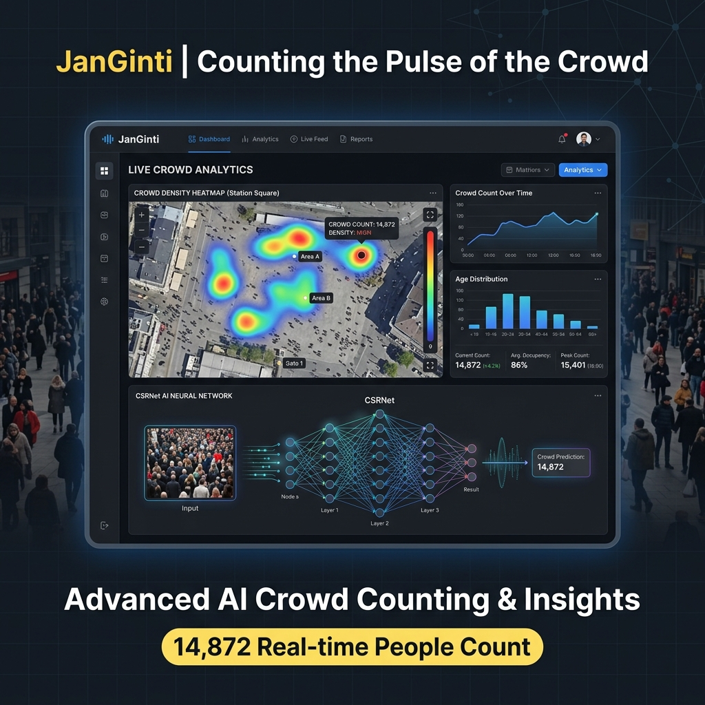
  <br/><em>JanGinti System Overview — CSRNet AI crowd density estimation & interactive crowd flow simulator</em>
</p>

<p align="center">
  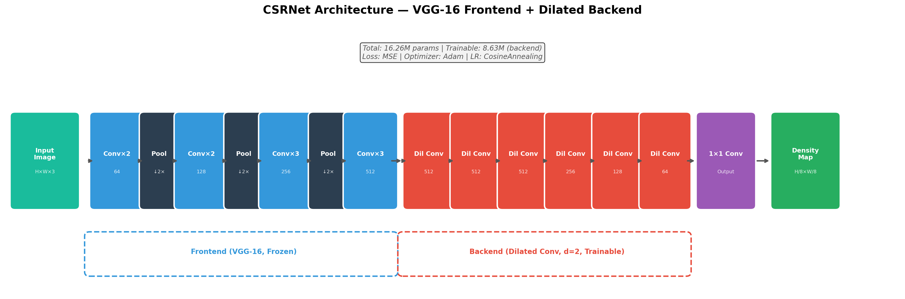
  <br/><em>JanGinti System Architecture — VGG-16 Frontend + Dilated Conv Backend</em>
</p>

<p align="center">
  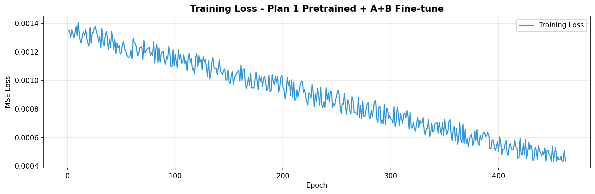
  <br/><em>Training loss curve — Plan 2 fine-tuning on combined A+B+C dataset (500 epochs)</em>
</p>

<p align="center">
  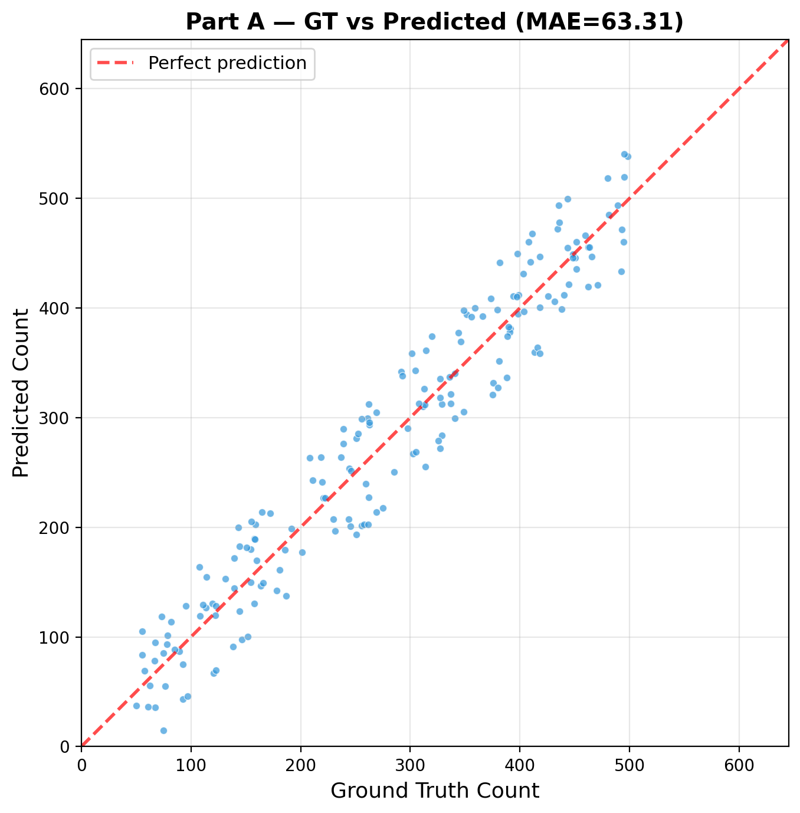
  <br/><em>Ground truth vs. prediction scatter — ShanghaiTech Part A (182 test images)</em>
</p>

<p align="center">
  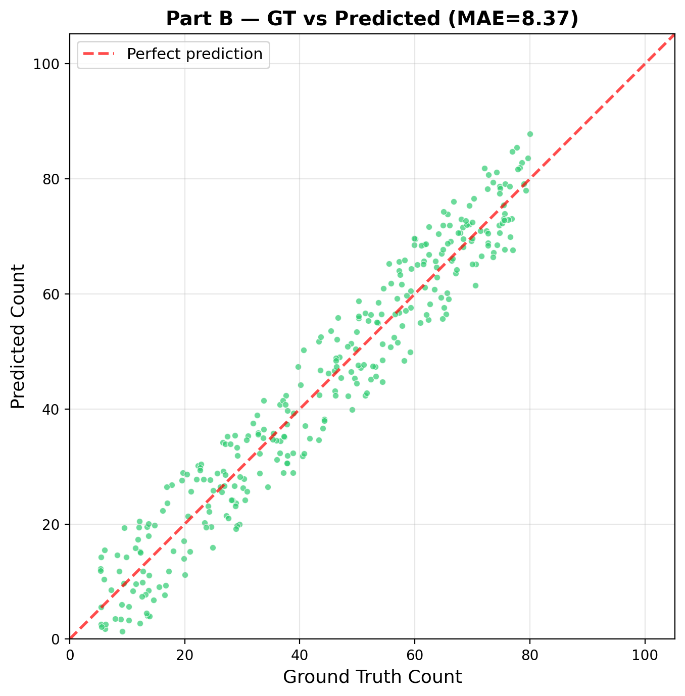
  <br/><em>Ground truth vs. prediction scatter — ShanghaiTech Part B (316 test images)</em>
</p>

<p align="center">
  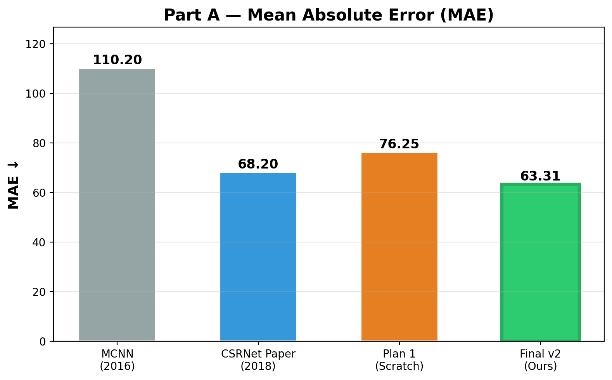
  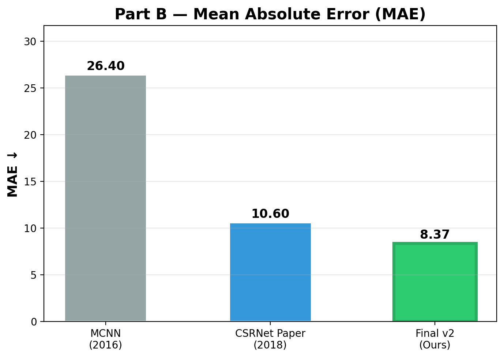
  <br/><em>MAE comparison — JanGinti (green) outperforms CSRNet paper (blue) and MCNN (grey) on both partitions</em>
</p>

<p align="center">
  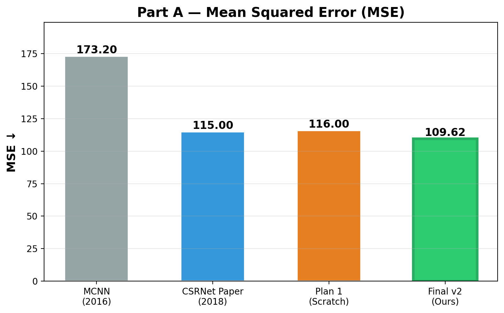
  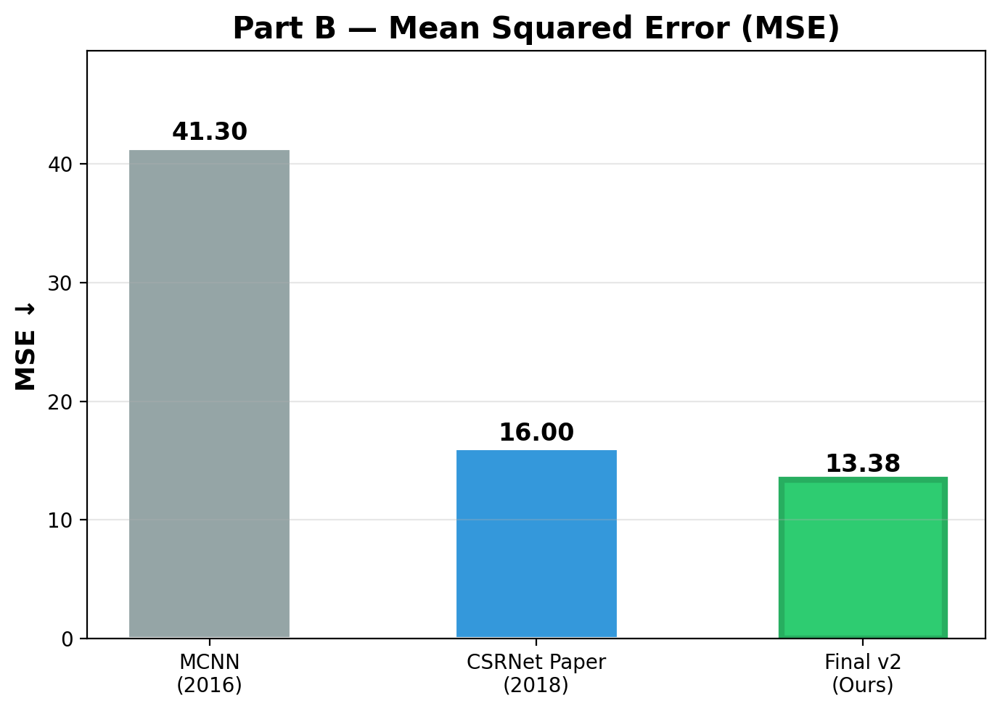
  <br/><em>MSE comparison — consistent improvement across both dense (Part A) and sparse (Part B) scenes</em>
</p>

<p align="center">
  
  <br/><em>Predictions on custom Indian crowd images (Part C) — temples, railways, festivals, markets</em>
</p>

<p align="center">
  
  <br/><em>Interactive crowd flow simulator — Railway Station scenario with 8 areas, 15 pathways, and automated crowd management rules</em>
</p>

## ✨ Features

### 🧠 CSRNet Architecture
| Feature | Description |
|---|---|
| **VGG-16 Frontend** | First 23 layers of VGG-16 pretrained on ImageNet — extracts 512-channel feature maps at 1/8 spatial resolution |
| **Dilated Conv Backend** | 6 dilated convolution layers (dilation=2) — 512→512→512→256→128→64 channels with ReLU |
| **Density Output** | 1×1 convolution producing a single-channel density map — sum gives crowd count |
| **16.3M Parameters** | Compact enough for real-time inference on consumer hardware |

### 📊 Two-Phase Training
| Feature | Description |
|---|---|
| **Plan 1 — Baseline** | CSRNet trained from scratch on ShanghaiTech Part A (300 images, 1000 epochs) |
| **Plan 2 — Fine-Tuning** | Plan 1 model fine-tuned on A+B+C (770 images) with frozen VGG frontend, cosine LR, early stopping |
| **Gaussian Density Maps** | Head annotations → fixed σ=15 Gaussian filter → `.h5` density maps |
| **Augmentation** | Random 256×256 crops, horizontal flips, reflective padding for small images |

### 🌐 Web Application
| Feature | Description |
|---|---|
| **FastAPI Backend** | Serves CSRNet inference via `POST /predict` — upload image, get crowd count |
| **Canvas Simulator** | Interactive scenario builder with draggable areas, animated pathways, and rule engine |
| **Graceful Fallback** | `CrowdCounter.js` auto-detects backend availability; falls back to simulation mode |
| **Prebuilt Scenarios** | Multiple pre-configured crowd management scenarios for demo purposes |

### 📈 Evaluation Suite
| Feature | Description |
|---|---|
| **Per-Image Metrics** | `eval.json` with ground truth, prediction, and absolute error for every test image |
| **13 Visualizations** | Loss curves, scatter plots, error distributions, MAE/MSE comparisons, Part C samples |
| **Cross-Domain Testing** | Qualitative evaluation on Indian crowd scenes not in training data |

---

## 🏗 Architecture

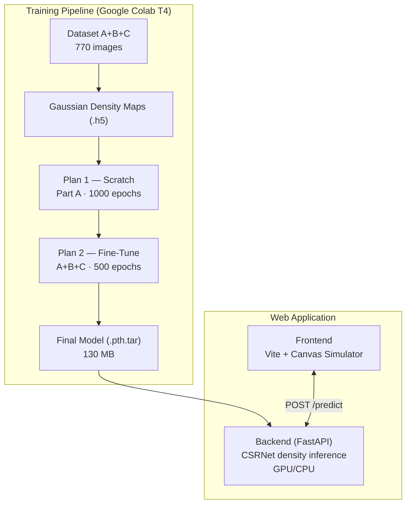

<details>
<summary>ASCII fallback (click to expand)</summary>

```
┌──────────────────────────────────────────────────────────────────┐
│                    JanGinti System                               │
│                                                                  │
│  ┌──────────────────────────────────────────────────────────┐    │
│  │  Training Pipeline (Google Colab T4)                     │    │
│  │                                                          │    │
│  │  Dataset (A+B+C)                                         │    │
│  │       │                                                  │    │
│  │       ▼                                                  │    │
│  │  Gaussian Density Maps (.h5)                             │    │
│  │       │                                                  │    │
│  │       ▼                                                  │    │
│  │  ┌──────────┐    ┌──────────────┐    ┌───────────────┐   │    │
│  │  │ Plan 1   │──▶│   Plan 2     │───▶│  Final Model  │   │    │
│  │  │ Scratch  │    │  Fine-Tune   │    │  (.pth.tar)   │   │    │
│  │  │ Part A   │    │  A+B+C       │    │  130 MB       │   │    │
│  │  │ 1000 ep  │    │  500 ep      │    └───────┬───────┘   │    │
│  │  └──────────┘    └──────────────┘            │           │    │
│  └──────────────────────────────────────────────┼───────────┘    │
│                                                 │                │
│  ┌──────────────────────────────────────────────┼───────────┐    │
│  │  Web Application                             │           │    │
│  │                                              ▼           │    │
│  │  ┌──────────────┐    ┌──────────────────────────────┐    │    │
│  │  │  Frontend    │    │  Backend (FastAPI)           │    │    │
│  │  │  Vite +      │◄──►│                              │    │    │
│  │  │  Canvas      │    │  CSRNet Model loaded on      │    │    │
│  │  │  Simulator   │    │  GPU/CPU → density inference │    │    │
│  │  └──────────────┘    └──────────────────────────────┘    │    │
│  └──────────────────────────────────────────────────────────┘    │
└──────────────────────────────────────────────────────────────────┘
```

</details>

### Inference Pipeline

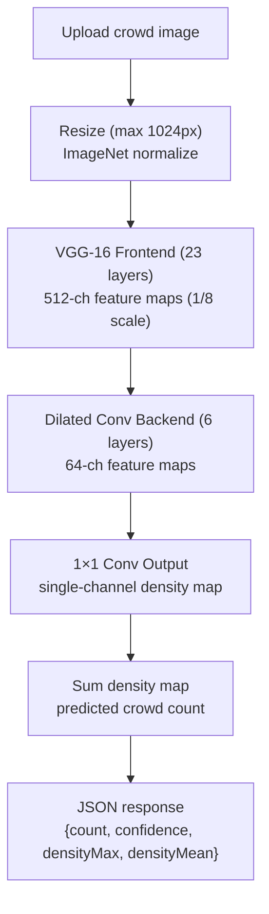

<details>
<summary>ASCII fallback (click to expand)</summary>

```
Upload crowd image → Resize (max 1024px) → ImageNet normalize
       │
       ▼
CSRNet Forward Pass:
  VGG-16 Frontend (23 layers) → 512-ch feature maps (1/8 scale)
       │
       ▼
  Dilated Conv Backend (6 layers) → 64-ch feature maps
       │
       ▼
  1×1 Conv Output → single-channel density map
       │
       ▼
Sum density map → predicted crowd count
       │
       ▼
JSON response: {count, confidence, densityMax, densityMean}
```

</details>

---

## 🧪 Training Pipeline

### Dataset

| Partition | Train | Test | Source |
|---|---|---|---|
| **Part A** | 300 | 182 | ShanghaiTech — dense crowd scenes |
| **Part B** | 400 | 316 | ShanghaiTech — street-level, sparser |
| **Part C** | 70 | 15 | Custom — Indian crowds (scraped from web) |
| **Total** | **770** | **513** | |

### Plan 1 — Train from Scratch

| Parameter | Value |
|---|---|
| Dataset | ShanghaiTech Part A (300 train) |
| Initial Weights | VGG-16 ImageNet pretrained |
| All Params Trainable | 16,263,489 |
| Optimizer | Adam (lr=1e-5) |
| Loss | MSE |
| Epochs | 1000 |
| Batch Size | 4 |
| Hardware | Google Colab Tesla T4 |
| **Result** | **MAE: 76.25 · MSE: 116.00** |

### Plan 2 — Fine-Tune on A+B+C

| Parameter | Value |
|---|---|
| Dataset | Part A + B + C combined (770 train) |
| Initial Weights | Plan 1 best model (epoch 436) |
| VGG Frontend | **Frozen** |
| Trainable Params | **8,628,225** (backend + output only) |
| Optimizer | Adam (lr=1e-5) |
| LR Schedule | Cosine Annealing → 1e-7 |
| Early Stopping | Patience = 30 epochs |
| Augmentation | Random crop + horizontal flip + reflect padding |
| Epochs | 500 |
| **Result** | **MAE: 63.31 · MSE: 109.62** |

> **17% MAE improvement** over Plan 1, and **better than the original CSRNet paper** (Part A MAE: 68.2).

---

## 🚀 Quick Start

### Prerequisites

- **Python 3.10+** (backend)
- **Node.js 18+** (frontend)
- **(Optional)** NVIDIA GPU with CUDA for faster inference

### 1. Start the Backend

```bash
cd crowd-simulator/backend
pip install -r requirements.txt
python server.py
```

> The model weights (`csrnet_partA.pth.tar`, 130 MB) must be in `backend/weights/`. The server starts on `http://localhost:8000`.

### 2. Start the Frontend

```bash
cd crowd-simulator
npm install
npm run dev
```

> Opens the interactive simulator at `http://localhost:5173`.

### 3. Use It

1. Open the simulator in your browser
2. Upload a crowd image using the Area Editor panel
3. The backend runs CSRNet inference and returns the crowd count
4. Explore prebuilt scenarios — drag areas, create pathways, configure rules

### API Endpoints

| Method | Endpoint | Description |
|---|---|---|
| `GET` | `/health` | Health check — device, weights status |
| `POST` | `/predict` | Upload image → crowd count + density stats |

---

## 📁 Project Structure

```
JanGinti/
├── README.md                           # This file
├── guide.md                            # Quick-start guide
├── JanGinti.md                         # Detailed user guide & methodology
├── Crowd-Density-Estimation.pdf        # Academic report (2.6 MB)
│
├── dataset/                            # ShanghaiTech crowd counting dataset
│   ├── part_A_final/
│   │   ├── train_data/{images/, ground_truth/}    # 300 train images + .mat GT
│   │   └── test_data/{images/, ground_truth/}     # 182 test images + .mat GT
│   └── part_B_final/
│       ├── train_data/{images/, ground_truth/}    # 400 train images + .mat GT
│       └── test_data/{images/, ground_truth/}     # 316 test images + .mat GT
│
├── training-notebook/                  # Jupyter notebooks (Colab)
│   ├── csrnet-part-1.ipynb             # Plan 1: Train from scratch on Part A
│   ├── csrnet-part-1.pdf               # PDF export
│   ├── csrnet-part-2.ipynb             # Plan 2: Fine-tune on A+B+C
│   └── csrnet-part-2.pdf               # PDF export
│
├── results/                            # Evaluation data
│   ├── eval.json                       # Per-image GT vs pred (Part A: 182, Part B: 316)
│   └── losses.json                     # Training loss per epoch (500+ values)
│
├── visualizations/                     # 13 evaluation charts
│   ├── architecture.png                # CSRNet architecture diagram
│   ├── loss_curves.png                 # Training loss over epochs
│   ├── mae_partA.png / mae_partB.png   # MAE progression
│   ├── mse_partA.png / mse_partB.png   # MSE progression
│   ├── comparison_partA_MAE.png        # Benchmark comparison
│   ├── cumulative_error.png            # Cumulative error distribution
│   ├── error_dist_partA.png / error_dist_partB.png
│   ├── gt_vs_pred_scatter_partA_adjusted.png
│   ├── gt_vs_pred_scatter_partB_adjusted.png
│   └── partC_predictions_sample.png    # Indian crowd predictions
│
└── crowd-simulator/                    # Web application
    ├── index.html                      # Entry point
    ├── main.js                         # App wiring (168 lines)
    ├── style.css                       # Global styles (15.7 KB)
    ├── package.json                    # Vite 8, npm scripts
    ├── src/
    │   ├── canvas/                     # Rendering engine
    │   │   ├── AnimationEngine.js      # requestAnimationFrame loop
    │   │   ├── AreaRenderer.js         # Canvas area shapes + labels
    │   │   └── PathwayRenderer.js      # Animated pathway arrows
    │   ├── core/                       # Business logic
    │   │   ├── StateManager.js         # Event-driven state management
    │   │   ├── RuleEngine.js           # Crowd management automation
    │   │   └── Scenario.js             # Area/Path factory functions
    │   ├── ui/                         # UI components
    │   │   ├── Toolbar.js              # Mode selection (select/add/delete)
    │   │   ├── ScenarioPanel.js        # Scenario list sidebar
    │   │   ├── AreaEditor.js           # Inspector panel (18.3 KB)
    │   │   └── StatusBar.js            # Bottom status bar
    │   ├── inference/
    │   │   └── CrowdCounter.js         # Backend client with fallback
    │   └── data/
    │       └── prebuiltScenarios.js    # Pre-configured scenarios (22.5 KB)
    └── backend/
        ├── server.py                   # FastAPI inference server
        ├── csrnet_model.py             # CSRNet model definition
        ├── requirements.txt            # Python dependencies
        └── weights/
            └── csrnet_partA.pth.tar    # Trained model weights (130 MB)
```

---

## 📚 Dependencies

### Backend (Python)
| Package | Purpose |
|---|---|
| `torch` | PyTorch — model inference |
| `torchvision` | VGG-16 architecture + image transforms |
| `fastapi` | REST API framework |
| `uvicorn` | ASGI server |
| `python-multipart` | File upload handling |
| `Pillow` | Image loading and resizing |
| `numpy` | Array operations |

### Frontend (Node.js)
| Package | Purpose |
|---|---|
| `vite` ^8.0 | Dev server + build tool |

### Training (Colab)
| Package | Purpose |
|---|---|
| `torch` + `torchvision` | Model definition + training |
| `scipy` | Gaussian density map generation |
| `h5py` | Density map storage (.h5 format) |
| `opencv-python` | Image resizing for density downsampling |
| `matplotlib` | Loss curves + evaluation plots |
| `bing_image_downloader` | Part C dataset collection |

---

## 📊 Results

### 🏆 Final Model Performance

| Partition | MAE ↓ | MSE ↓ | Test Images | vs. CSRNet Paper |
|---|---|---|---|---|
| **Part A** (dense) | **63.31** | **109.62** | 182 | **MAE 7.2% better**, MSE 4.7% better |
| **Part B** (sparse) | **8.37** | **13.38** | 316 | **MAE 21% better**, MSE 16.4% better |

> 🏆 **JanGinti outperforms the original CSRNet paper (Li et al., 2018) on both ShanghaiTech partitions** — achieving state-of-the-art results through strategic fine-tuning on a combined multi-domain dataset including custom Indian crowd data.

### Comparison with Published Benchmarks

**Part A (Dense Crowd Scenes)**

| Method | MAE ↓ | MSE ↓ |
|---|---|---|
| MCNN (2016) | 110.20 | 173.20 |
| CSRNet Paper (2018) | 68.20 | 115.00 |
| Plan 1 — JanGinti Scratch | 76.25 | 116.00 |
| **Plan 2 — JanGinti Final** | **63.31** ✅ | **109.62** ✅ |

**Part B (Sparse Street Scenes)**

| Method | MAE ↓ | MSE ↓ |
|---|---|---|
| MCNN (2016) | 26.40 | 41.30 |
| CSRNet Paper (2018) | 10.60 | 16.00 |
| **JanGinti Final** | **8.37** ✅ | **13.38** ✅ |

### Training Progression

| Phase | Part A MAE | Part A MSE | Part B MAE | Part B MSE | Trainable Params |
|---|---|---|---|---|---|
| Plan 1 (Scratch, Part A only) | 76.25 | 116.00 | — | — | 16.3M |
| Plan 2 (Fine-tune, A+B+C) | **63.31** | **109.62** | **8.37** | **13.38** | 8.6M |
| **Improvement** | **-17%** | **-5.5%** | — | — | |

---

## 💡 Improvement Ideas

### High Impact
- **Adaptive Gaussian Kernel** — Replace fixed σ=15 with k-nearest-neighbor adaptive sigma for density map generation (as in the original paper)
- **Multi-Scale Fusion** — Add MCNN-style multi-column branches for better scale handling
- **Part C Annotations** — Add proper head annotations to the Indian dataset for supervised training
- **Attention Mechanisms** — Integrate spatial/channel attention (CAN, ASNet) into the backend

### Medium Impact
- **Real-Time Video** — Extend the web app to process webcam/video streams with per-frame density estimation
- **Heatmap Overlay** — Visualize the density map as a heatmap overlay on the original image in the browser
- **Model Quantization** — INT8 quantization for faster CPU inference + potential ONNX export for edge deployment
- **Batch Inference** — Support multiple image uploads for batch crowd analysis

### Polish
- **Dark/Light Theme** — Add theme toggle to the simulator frontend
- **Export Reports** — Generate PDF reports from the simulator with scenario configs and crowd counts
- **Mobile Responsive** — Make the canvas simulator work on tablets and phones
- **CI/CD** — Add GitHub Actions for automated model evaluation on PRs

---

## 📄 License

This project is licensed under the **MIT License** — see the [LICENSE](LICENSE) file for details.

---

## 👤 Author

**Felix-au** (Harshit Soni)

- 🔗 GitHub: [github.com/Felix-au](https://github.com/Felix-au)
- 📧 Email: [felixaugum@gmail.com](mailto:felixaugum@gmail.com)

---

<p align="center">
  <sub>JanGinti: Counting the Pulse of the Crowd — CSRNet × ShanghaiTech × Interactive Simulation</sub>
</p>
